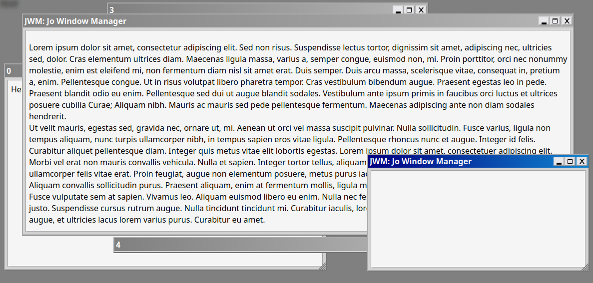

# [J-BAUER][EN] Jo Windows Manager
**J.W.M.** is a window management system written in javascript fully clientside for use on a website.
Designed to be robust, lightweight and modular, this script can be easily installed and integrated into your website, and offers a wide range of configuration options that can be easily customized to suit your needs.

> **By Jonathan BAUER (J-BAUER)**</br>
> Version: 1.0</br>
> Date: 02/11/2024</br>
> License: Apache 2.0

## Demo


## How Does It Work ?
The system operates in three main stages:
1. **Create an instance of `JWM_WindowManager`**: This class manages all the windows it creates, providing a convenient way to create, modify, and update windows.
2. **Create a new window**: Using your `JWM_WindowManager` instance, you can create an empty `JWM_Window` by calling the `newWindow` function and passing custom parameters to customize the window.
3. **Populate your window**: Call the `open` function on the window object, specifying the title and body of the window.

### Advanced Features
For more complex windows, you can use hot-loaded JavaScript files. The system automatically loads and unloads JavaScript included in the body of the window. The same files can be loaded multiple times but will only be fetched once for network optimization, and are unloaded when no remaining windows use them.

To use this functionality, simply include a `<script>` element with the file's `src` attribute inside the window's body as usual. If needed, define the following functions in your JS file:

- `JWM_JS_LOAD()`
- `JWM_JS_UNLOAD()`
- `JWM_JS_OPEN(obj_window, ...args)`
- `JWM_JS_UPDATE(obj_window, ...args)`
- `JWM_JS_CLOSE(obj_window, ...args)`

These functions allow you to execute specific actions based on your requirements. The `JWM_JS_UNLOAD` function, in particular, is important to define, as it is used to clean up or delete the JS element when it is no longer needed.

## How to Install It
Installing J.W.M. is straightforward. Simply add the following line in the `<head>` section of your page, before any other JavaScript files:
```html
<script src="jwm_1-0-0.js"></script>
```
That's all you need to do!

## Example 
### Simple Window Example
Below is an example of how to create and use a window with `JWM_WindowManager`:
```javascript
// Step 1: Create an instance of JWM_WindowManager
const windowManager = new JWM_WindowManager()

// Step 2: Create a new window
const myWindow = windowManager.newWindow(null, {
    width: 400,
    height: 300,
    resizable: true
});

// Step 3: Populate the window
myWindow.open("My Window Title", "<p>Welcome to my window content!</p>");
```

### Advanced Script Example
Below is an example of how to create and use a window with `JWM_WindowManager` and one hot-loaded JavaScript file:
```javascript (main.js)
// Step 1: Create an instance of JWM_WindowManager
const windowManager = new JWM_WindowManager()

// Step 2: Create a new window
const myWindow = windowManager.newWindow(null, {
    width: 400,
    height: 300,
    resizable: true
});

// Step 3: Populate the window
myWindow.open("My Window Title", "<script src="hl_script.js"></script><p>Welcome to my window content!</p>");
```
In your hl_script.js file, you can define the following functions:
```javascript (hl_script.js)
function JWM_JS_LOAD() {
  console.log("JavaScript file loaded!");
}

function JWM_JS_UNLOAD() {
  console.log("JavaScript file unloaded!");
  // Unload variable, object, table, etc...
}

function JWM_JS_OPEN(...args) {
  console.log("A new window using this file has been opened with arguments:", args);
}

function JWM_JS_UPDATE(...args) {
  console.log("A window using this file has been updated with arguments:", args);
}

function JWM_JS_CLOSE(...args) {
  console.log("A window using this file has been closed with arguments:", args);
}
```
With this setup, the system will handle loading and unloading the script automatically as the window is opened or closed and the script is no longer used.